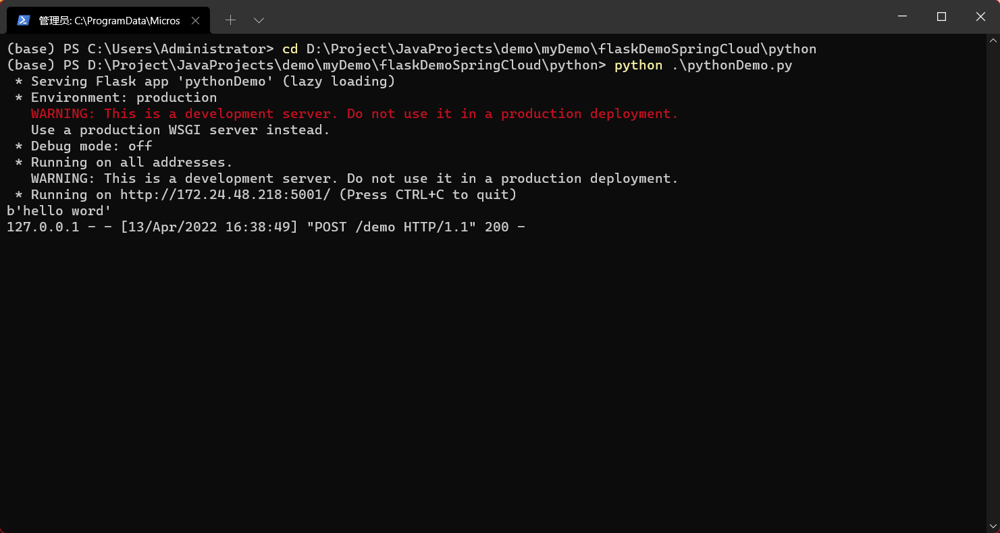
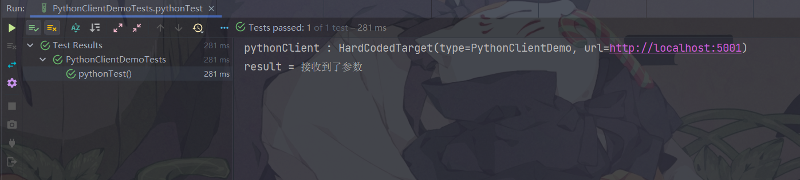

# 本仓库主要存放自己写的一些功能demo模块，便于开发

[toc]

# algorithm

## acm

acm模式对一些的数据的处理demo

# flask

## flaskDemo

java 后端使用 io.github.openfeign post/get python创建的http接口

python 使用 flask 创建简单的web服务

python端

java端

# python

## Monitor

Linux使用python监视GPU使用情况，并将之通过右键发送信息

# spring

## generator

mybatis plus 代码生成器demo